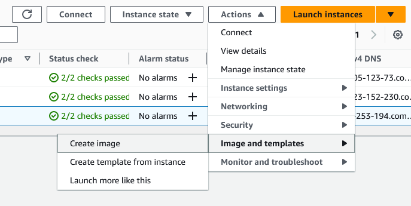

# MLOps End-to-End Workflow using AWS

    

This repo contains my notes & files from the MLOps Zoomcamp project using [NYC taxi data](https://www.nyc.gov/site/tlc/about/tlc-trip-record-data.page) to demonstrate MLOps processes. Instead of carrying out the project on a local system I have set up resources using AWS. I also made some slight changes such as using EC2 instance roles and  AWS Secrets Manager. If you want to follow along then you'll need an AWS account within the free tier (minimize costs) and some experience using AWS.

## Costs
---

There are small charges but it is mostly be free.  AWS Free tier information: [AWS Free Tier](https://aws.amazon.com/free/?all-free-tier.sort-by=item.additionalFields.SortRank&all-free-tier.sort-order=asc&awsf.Free%20Tier%20Types=*all&awsf.Free%20Tier%20Categories=categories%23serverless)

TIP: Project is long so stop / terminate instances when taking a break. Create an AMI for the main Linux environment to prevent having to install packages repeatably.

## AWS Resources
---
Here is a list of the AWS resources that will be created: 
* EC2 Instance for Linux Environment
* EC2 Instance for MLflow server
* EC2 Instance for Prefect Server
* IAM Role for MLflow instance
* IAM Role for Prefect instance
* IAM User for Prefect Block Storage
* RDS instance
* S3 bucket for MLflow
* S3 bucket for Prefect Block 

You will also need to configure a named AWS profile. [This video](https://www.youtube.com/watch?v=vTJSV5xeQ5c) shows how you can do this.\
I created a user profile with an IAM user with full admin access for this demo but you can also consider creating a user with more limited access. (apply least-privilege permissions).
## Tracking sheet
---
Use trackingsheet.txt to keep track of the infrastructure details. With so many resources it is easy to loose track of IP addresses and the names of S3 buckets. Download the file and save locally updating each time you create a resource.

## Set up Linux Environment Virtual Machine
---
I'm working on a windows system so I spin up an EC2 instance in AWS to run notebooks and code. This instance does charge around $0.10 depending on region so I stop the instance when I'm not using it or create an AMI after installing the required packages, terminate the instance and then create a new instance when needed using the AMI.

### 1. Launch the EC2 instance.
---
I followed the same steps to set up the VM demonstrated by Alexey in [MLOps Zoomcamp 1.2 - Enviroment preparation](https://www.youtube.com/watch?v=IXSiYkP23zo&list=PL3MmuxUbc_hIUISrluw_A7wDSmfOhErJK). I used Amazon Linux instead of Ubuntu but the steaps should be the same \
-> Launch an EC2 instance. \
-> Give it a name (e.g. 'mlops-zoomcamp')\
-> Choose Ubuntu / Amazon Linux AMI \
-> Use t2.large instance \
-> Select a key pair \
-> 30GB gp3 EBS volume \
Other settings can be left as default.

 ### 2. Connect to the instance and install packages
---
Again these are the same steps as [MLOps Zoomcamp 1.2 - Enviroment preparation](https://www.youtube.com/watch?v=IXSiYkP23zo&list=PL3MmuxUbc_hIUISrluw_A7wDSmfOhErJK). I have also carried these steps out on an Amazon Linux 2023 AMI as well as Ubuntu. Follow the steps that apply to the instance you have set up. 
1. Open a new terminal and connect to the 'mlops-zoomcamp' instance with SSH

2. (OPTIONAL) If using Amazon Linux 2023 you need to install Git & pip:
    ```console
    sudo dnf install -y git
    sudo dnf install -y pip
    ``` 
4. Install Anaconda:
    ```console
    wget https://repo.anaconda.com/archive/Anaconda3-2023.03-1-Linux-x86_64.sh
    ```
    ```console
    bash Anaconda3-2023.03-1-Linux-x86_64.sh
    ```

5. Install Docker & Docker Compose\
    Open new terminal and run to install Docker:
    ```console
    sudo dnf install docker
    ```
    Install Docker Compose:
    ```console
    mkdir soft
    cd soft
    wget https://github.com/docker/compose/releases/download/v2.18.1/docker-compose-linux-x86_64 -O docker-compose
    ```

6. Make docker compose executable \
    Run:
    ```console
    chmod +x docker-compose
    ```
2. Change directory:
    ```console
    cd ..
    ```
3. To add to the soft directory to PATH first open the .bashrc file with nano:
    ```console
    nano ~/.bashrc
    ```
4. Add the following line into the file:
    ```console
    export PATH="${HOME}/soft:${PATH}"
    ```
5. Add user to the docker group
    ```console
    sudo groupadd docker
    sudo usermod –aG docker $USER
    ```
    Log in and out.
6. Run Docker
    ```console
    sudo service docker start
    docker run hello-world
    ```

7. Clone the repository with the files that you wish to use
    ```console
    git clone https://github.com/[account]/[repo].git
    ```

### 3. (OPTIONAL) Create AMI of this instance
---
Highlight the instance and go to:
\
You will then be able to terminate the instance and use this AMI to create a new one.

