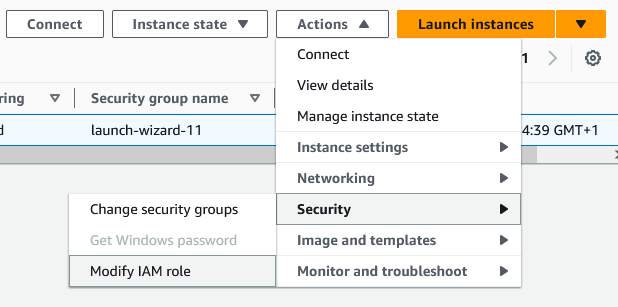

# Experiment tracking with MLflow and AWS

In this section we'll:
* Set up the EC2 instance, RDS database, and S3 bucket in AWS
* Connect to the EC2 instance and initiate the MLflow server
* Run training notebook to carry out experiments and train a model


## 1. Launch the MLflow Instance

Launch an EC2 instance for the remote tracking server.  From the console got to EC2, Instances and select 'Launch Instances'.

 You can just use a free tier Amazon Linux AMI with t2.micro instance type. Create or select  a key pair and leave everything else as default. 

Now launch the instance and wait until the 'Instance State' is 'ready' and the status  checks have completed.

## 2. Configure security group inbound rules

Select the MLflow EC2 instance, select the 'Security' tab and then select the security group. Edit inbound rules and add the following rule:

\


## 3. Give instance permission to access S3 and RDS

S3 is used for the MLflow artifact store and a PostgreSQL database in RDS is used for the backend store so the instance needs to be able to have permission to access both services. To do this we create an IAM role which has access to S3 and RDS.

<span style="color:green">**->**</span> Create a new role in IAM 

<span style="color:green">**->**</span>  Select trusted entity as EC2

\


<span style="color:green">**->**</span>  In permissions add 'AmazonS3FullAccess', 'AmazonRDSFullAccess' and 'SecretsManagerReadWrite'


## 4. Attach IAM role to MLflow server instance

<span style="color:green">**->**</span>  Navigate back to EC2 and select your instance. Click Actions -> Security -> Modify IAM role. 



<span style="color:green">**->**</span> Select the IAM role you created in the previous step and click 'Update IAM role'


## 5. Create RDS instance forMLflow backend store

We will be using an Amazon RDS database instance with PostgreSQL as the MLflow backend store. Now we will set this up. 

<span style="color:green">**->**</span> Navigate to the RDS dashboard from the Console and select 'Create database'


Select the following options:

<span style="color:green">**->**</span> **Database creation method:**  'Standard create'


<span style="color:green">**->**</span> **Engine:** ' PostgreSQL' 


<span style="color:green">**->**</span> **Templates:** ' Free Tier ' 


<span style="color:green">**->**</span> **Settings:** Set DB instance indentifier, set master username and choose Secrets Manager for password


<span style="color:green">**->**</span> **Instance configuration:**' db.t3.micro '


<span style="color:green">**->**</span> **Storage:**


<span style="color:green">**->**</span> **Connectivity:** Leave all as default or configure as you wish.

<span style="color:green">**->**</span> **Database authentication:** Password authentication

<span style="color:green">**->**</span> **Monitoring:** You can leave as default or turn off performance insights.

<span style="color:green">**->**</span> **Additional configuration:** Choose 'Initial database name'. Enable or disable automated backups. Leave all else as default.


<span style="color:green">**->**</span> Scroll to the end and click 'Create Database'

## 6. Edit inbound rules for RDS instance

Click on the instance. Under Connectivity & Security -> 'VPC security groups' and add inbound rule where the source is the security group of the Mlflow instance:


## 7. Create S3 bucket for MLflow artifacts

<span style="color:green">**->**</span> Choose a globally unique name for the bucket


## 8. Initialize Mlflow

<span style="color:green">**->**</span>  Open terminal and connect to the EC2 instance with SSH

<span style="color:green">**->**</span>  Current Amazon linux 2023 does not have pip so we need to install it.

```console
sudo dnf install pip
```

<span style="color:green">**->**</span>  Install packages:
```console
pip install mlflow boto3 psycopg2-binary
```

<span style="color:green">**->**</span>  We opted to use Secrets Manager for the RDS database password so we can retrieve it by running this line. You need replace `<secret_arn>` with the ARN from Secrets Manager.

```console
SECRET_VALUE=$(aws secretsmanager get-secret-value --secret-id '<secret_arn>' --query 'SecretString' --output text)
```

<span style="color:green">**->**</span>Then run to set the variables: 

```console
DB_USER=$(echo $SECRET_VALUE | jq -r '.username')
DB_PASSWORD=$(echo $SECRET_VALUE | jq -r '.password')
```
<span style="color:green">**->**</span> Now run the following inputting `<rds_db_endpoint>`, `<db_name>` and `<s3_bucket_name>`

```console
mlflow server -h 0.0.0.0 -p 5000 \
--backend-store-uri "postgresql://${DB_USER}:${DB_PASSWORD}@<rds_db_endpoint>:5432/<db_name>" \
--default-artifact-root "s3://<s3_bucket_name>" 
```

<span style="color:green">**->**</span> To see the tracking server in your browser type:  ``` <mlflow_EC2instance_dns>:5000 ```


## 9. Run notebook to carry out experiments in MLflow

This can either be done on your local machine or with the 'mlopszoomcamp-instance' EC2 instance. \
To reduce EC2 charges on AWS I will just run this part on my local machine.
### Local Machine
---
<span style="color:green">**->**</span> Open up a new terminal

<span style="color:green">**->**</span> Make a note of the python and xgboost versions

```console
py --version
pip show xgboost
```

<span style="color:green">**->**</span>  Configure AWS credentials. Open up a new terminal and type:

```console
aws configure --profile [name]
```

<span style="color:green">**->**</span> Then when prompted enter the 'AWS Access Key ID' and corresponding 'AWS Secret Access Key' and 'Default region name'.

<span style="color:green">**->**</span> Open up XGboost.ipynb in VS Code

<span style="color:green">**->**</span> Update the following block of code

```python
import mlflow
import os
os.environ["AWS_PROFILE"] = "" # fill in with your AWS profile name
TRACKING_SERVER_HOST = "" # fill in with the public DNS of the MLflow EC2 instance
mlflow.set_tracking_uri(f"http://{TRACKING_SERVER_HOST}:5000")
mlflow.set_experiment("xgboost-experiment")
```

<span style="color:green">**->**</span> Run notebook code down to second to last code block: (this may take ~2 hours)

```python
best_result = fmin(
fn=objective,
space=search_space,
algo=tpe.suggest,
max_evals=50,
trials=Trials()
)
```

<span style="color:green">**->**</span> When the code has finished running, navigate MLflow, and sort experiment by rmse


<span style="color:green">**->**</span> Click the experiment with lowest rmse 

<span style="color:green">**->**</span> Make a record of the parameters 


## In the next section we set up the Prefect server, productionize the code in this notebook, and produce a model in the MLflow model registry.