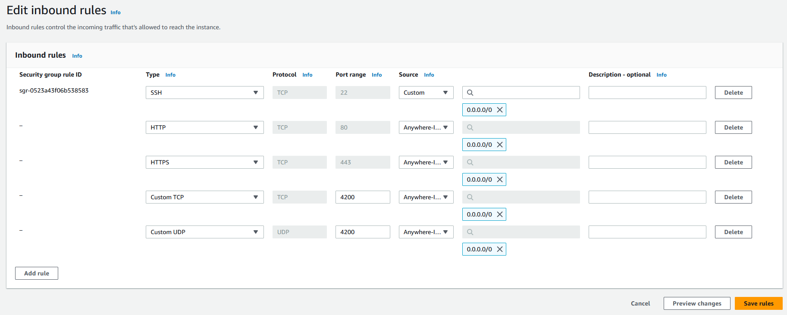
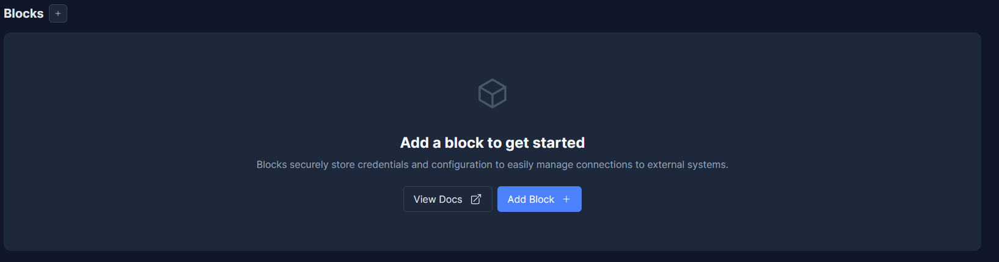
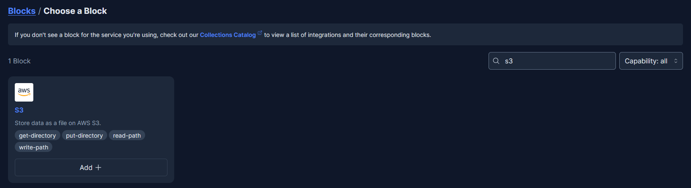
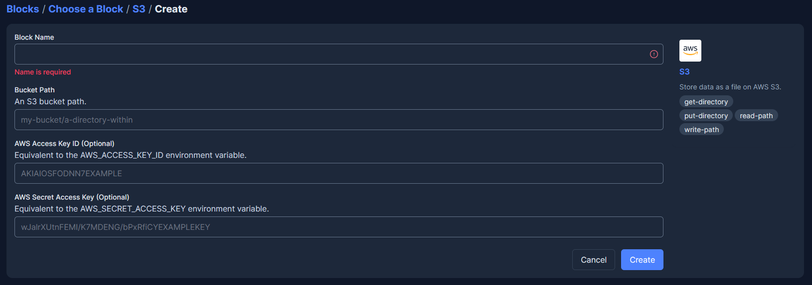
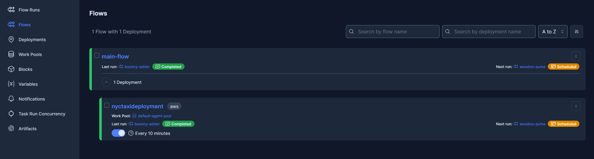

# Workflow Orchestration with Prefect and AWS
In this section we will:
* Set up the Prefect server
* Run the productionized version of the notebook code which includes Prefect decorators
* Produce a model in the MLflow model registry

## 1. Launch the Prefect Instance

Use a free tier Amazon Linux AMI with t2.micro instance type. Create or select  a key pair and leave everything else as default. 

Now launch the instance and wait until the 'Instance State' is 'ready' and the status  checks have completed.


## 2. Configure security group inbound rules

<span style="color:green">**->**</span> Select the Prefect instance \
<span style="color:green">**->**</span> Select the 'Security' tab and then select the security group \
<span style="color:green">**->**</span> Edit inbound rules and add the following rules:



## 3. Create role and attach it to Prefect Instance

The instance needs to be able to connect to S3 so create a role with S3 access, then attach it to the instance. \
Carry out in the same way as we did the role for the MLflow instance. 

<span style="color:green">**->**</span> Create  a new role and attach 'AmazonS3FullAccess' policy. 

<span style="color:green">**->**</span>Then attach this role to the instance.

## 4. Connect to and configure the Prefect instance

<span style="color:green">**->**</span> Open new terminal and connect to the EC2 instance with SSH

<span style="color:green">**->**</span> Install pip:

```console
sudo dnf install -y pip
```

<span style="color:green">**->**</span> Current Amazon Linux 2023 has Python 3.9 but for Prefect we need to use Python 3.10+ so we install Python 3.11.

```console
sudo dnf install python3.11
```

<span style="color:green">**->**</span> Install pip for Python 3.11  by running the following command:

```console
python3.11 -m ensurepip
```

<span style="color:green">**->**</span> Upgrade pip to latest version:

```console
python3.11 -m pip install --upgrade pip
```
<span style="color:green">**->**</span> Install pipenv:

```console
python3.11 -m pip install --user pipenv
```
<span style="color:green">**->**</span> Create a new virtual environment with Python 3.11 using pipenv by running the following command:

```console
python3.11 -m pipenv --python 3.11
```
<span style="color:green">**->**</span> Activate the virtual environment:

```console
python3.11 -m pipenv shell
```

<span style="color:green">**->**</span> Now install Prefect:

```console
pip install prefect
```

<span style="color:green">**->**</span> Set Prefect Orion GUI to Prefect instances IP address and start Orion
```console
prefect config set PREFECT_UI_API_URL="http://<prefect_instance_IP>:4200/api"
```

```console
prefect orion start --host 0.0.0.0
```
<span style="color:green">**->**</span> In your browser go to: ` <prefect_instance_DNS>:4200/api`

## 5. Configure S3 Storage block

<span style="color:green">**->**</span> Set up remote storage for Prefect by creating an S3 storage block.



<span style="color:green">**->**</span> Type 'S3' into the search bar:



<span style="color:green">**->**</span> Fill in the details (**READ BELOW**):


<span style="color:green">**->**</span> Create an IAM user which only has access to the S3 bucket you will provide here. Add the following policy for the IAM User:

```json
{
	"Id": "BucketPolicy",
	"Version": "2012-10-17",
	"Statement": [
		{
			"Sid": "AllAccess",
			"Action": "s3:*",
			"Effect": "Allow",
			"Resource": [
				"arn:aws:s3:::prefect-bucket-63727",
				"arn:aws:s3:::prefect-bucket-63727/*"
			]
		}
	]
}
```

## 5. Connect to the 'mlops-zoomcamp' instance

From this point onwards I will use the virtual machine created to provide a Linux environment

<span style="color:green">**->**</span> Open a new terminal and connect to the 'mlops-zoomcamp' instance with SSH

<span style="color:green">**->**</span>Create a Virtual Environment activate it and install packages

```console
conda create -n prefect-env python=3.10 -y
conda activate prefect-env
pip install requirements.txt
```

<span style="color:green">**->**</span> Configure AWS profile

```console
aws configure --profile [NAME]
export AWS_PROFILE=[NAME]
```

<span style="color:green">**->**</span> Prefect Orion is running on prefect-server and the GUI is started, so now run: \

```console
prefect config set PREFECT_API_URL="http://<prefect_instance_IP>:4200/api"
```

<span style="color:green">**->**</span> Run the Orchestration file. Navigate to directory where the the orchestrate.py file is and run:

```console
python orchestration.py
```
<span style="color:green">**->**</span> Build .yaml file for the deployment:

```console
prefect deployment build orchestrate.py:main_flow --name {name of deployment} --tag aws --storage-block s3/{block name}
```

<span style="color:green">**->**</span> Create a deployment on Prefect API:

```console
prefect deployment apply {PATH TO YAML FILE}
prefect deployment ls
```

<span style="color:green">**->**</span> Start an agent:

```console
prefect agent start -p {WORK_POOL_NAME}
```

<span style="color:green">**->**</span> (Optional) In a new terminal execute the deployment:

```console
prefect deployment run [OPTIONS] {DEPLOYMENT_NAME}
```

<span style="color:green">**->**</span> Go to 'Flows' and click the 3-dots button to create a schedule:


